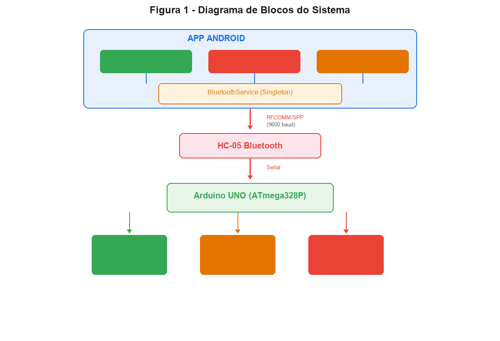
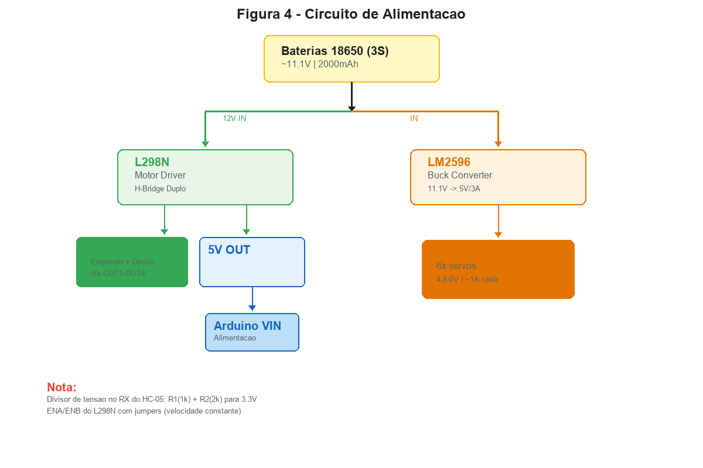
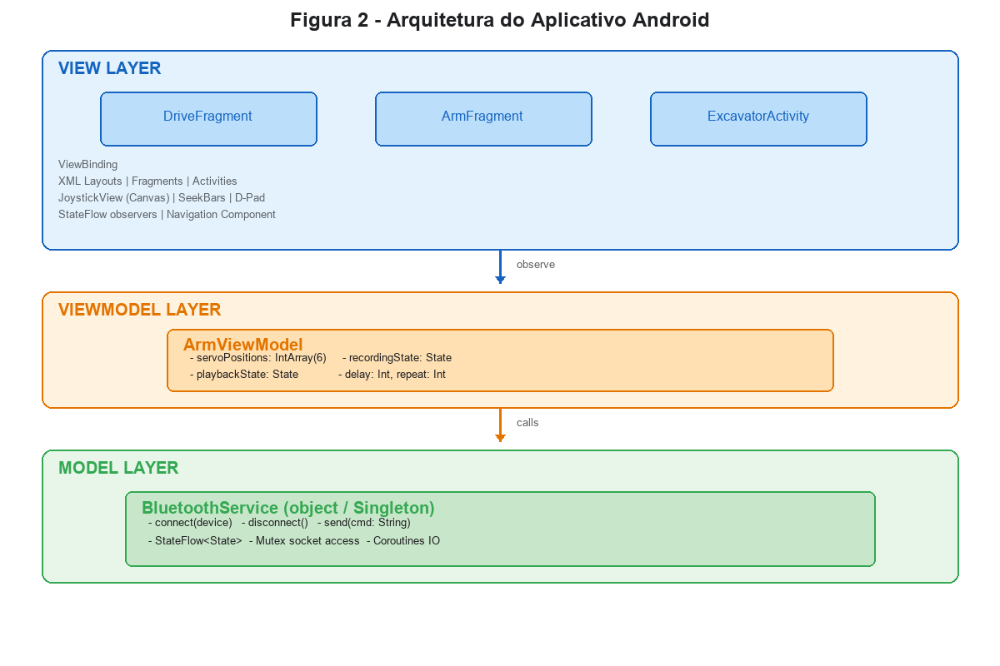
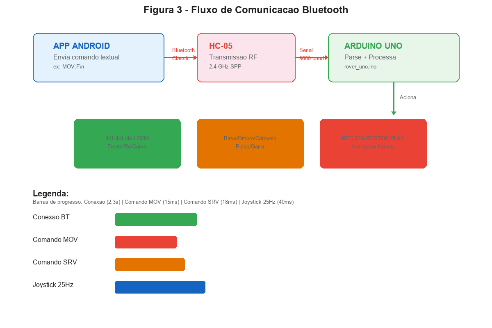
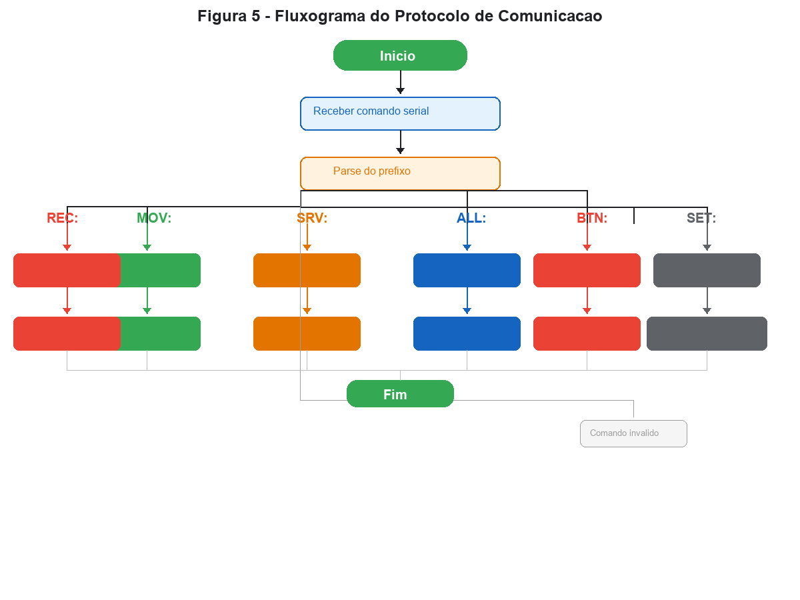

# RELATÓRIO TÉCNICO

## CONTROLE REMOTO DE ROVER ROBÓTICO VIA BLUETOOTH UTILIZANDO APLICATIVO ANDROID

---

### Sande

**Projeto:** Rover Control - Aplicativo Android para Controle de Rover Robótico

**Data:** Julho de 2026

**Localização:** [Cidade, Estado]

---

## RESUMO

Este relatório técnico apresenta o desenvolvimento de um sistema de controle remoto para rover robótico utilizando um aplicativo Android e comunicação Bluetooth Classic. O sistema é composto por um aplicativo nativo desenvolvido em Kotlin, um módulo Arduino UNO com driver de motor L298N e seis servos MG996R para braço robótico, e módulo Bluetooth HC-05 para comunicação sem fio. O aplicativo oferece três modos de operação: direção com joystick analógico e D-pad, controle individual de servos com presets e gravação de sequências, e modo escavadeira com dual joystick. Os resultados demonstram que o sistema é eficiente, responsivo e fácil de utilizar, atendendo aos requisitos de controle de robôs móveis em aplicações educacionais e de prototipagem rápida.

**Palavras-chave:** Bluetooth, Arduino, Android, Robótica, Controle Remoto, IoT.

---

## LISTA DE FIGURAS

1. Figura 1 - Diagrama de blocos do sistema
2. Figura 2 - Arquitetura do aplicativo Android
3. Figura 3 - Fluxo de comunicação Bluetooth
4. Figura 4 - Diagrama de pinagem do Arduino UNO
5. Figura 5 - Circuito de alimentação
6. Figura 6 - Interface do modo de direção
7. Figura 7 - Interface do modo braço robótico
8. Figura 8 - Interface do modo escavadeira
9. Figura 9 - Fluxograma do protocolo de comunicação

---

## LISTA DE TABELAS

1. Tabela 1 - Especificações do hardware
2. Tabela 2 - Pinagem do Arduino UNO
3. Tabela 3 - Pinagem do L298N
4. Tabela 4 - Especificações dos servos
5. Tabela 5 - Comandos do protocolo Bluetooth
6. Tabela 6 - Valores do joystick
7. Tabela 7 - Tecnologias utilizadas no Android
8. Tabela 8 - Resultados dos testes de comunicação

---

## LISTA DE SIGLAS E ABREVIATURAS

- **ABNT** - Associação Brasileira de Normas Técnicas
- **API** - Application Programming Interface
- **BT** - Bluetooth
- **DC** - Direct Current (Corrente Contínua)
- **GPIO** - General Purpose Input/Output
- **HC-05** - Módulo Bluetooth Classic
- **IDE** - Integrated Development Environment
- **IoT** - Internet of Things
- **L298N** - Driver de Motor Duplo H-Bridge
- **MVVM** - Model-View-ViewModel
- **PWM** - Pulse Width Modulation
- **RFCOMM** - Radio Frequency Communication
- **SDK** - Software Development Kit
- **SPP** - Serial Port Profile
- **UI** - User Interface
- **USB** - Universal Serial Bus
- **UX** - User Experience

---

## SUMÁRIO

1. Introdução
   1.1. Contexto
   1.2. Objetivo
   1.3. Escopo
2. Referencial Teórico
   2.1. Bluetooth Classic
   2.2. Arduino UNO
   2.3. Android SDK
   2.4. Driver L298N
   2.5. Servos MG996R
3. Materiais e Métodos
   3.1. Materiais Utilizados
   3.2. Metodologia de Desenvolvimento
   3.3. Arquitetura do Sistema
4. Desenvolvimento
   4.1. Hardware
   4.2. Firmware Arduino
   4.3. Aplicativo Android
   4.4. Protocolo de Comunicação
5. Resultados e Discussão
   5.1. Testes de Comunicação
   5.2. Testes de Funcionalidade
   5.3. Desempenho
6. Conclusão
   6.1. Resumo
   6.2. Limitações
   6.3. Trabalhos Futuros
Referências
Anexos

---

## 1. INTRODUÇÃO

### 1.1. Contexto

A robótica móvel tem ganhado crescente importância em diversos setores, desde automação industrial até aplicações educacionais. O controle remoto de robôs permite operações à distância, aumentando a segurança e a flexibilidade de operação [1].

O desenvolvimento de sistemas de controle remoto tem evoluído significativamente com o avanço das tecnologias sem fio. O Bluetooth Classic, especificamente, oferece uma solução confiável e de baixo custo para comunicação de dados em curta distância, sendo amplamente utilizado em dispositivos embarcados [2].

### 1.2. Objetivo

O objetivo principal deste projeto é desenvolver um sistema completo de controle remoto para rover robótico, composto por:

1. Aplicativo Android nativo para interface de controle
2. Firmware Arduino para processamento de comandos
3. Comunicação Bluetooth Classic para transmissão de dados

### 1.3. Escopo

O escopo do projeto inclui:

- Controle de movimentação (frente, ré, esquerda, direita)
- Controle de braço robótico com 6 graus de liberdade
- Modo de operação escavadeira
- Gravação e reprodução de sequências de movimentos
- Interface gráfica intuitiva em modo paisagem

---

## 2. REFERENCIAL TEÓRICO

### 2.1. Bluetooth Classic

O Bluetooth é uma tecnologia de comunicação sem fio de curta distância desenvolvida originalmente pela Ericsson em 1994. O Bluetooth Classic opera na faixa de 2.4 GHz e suporta taxas de transmissão de até 3 Mbps, sendo adequado para transferência de dados em tempo real [2].

O perfil SPP (Serial Port Profile) permite a emulação de uma porta serial via Bluetooth, facilitando a integração com dispositivos embarcados que utilizam comunicação UART [3].

### 2.2. Arduino UNO

O Arduino UNO é uma placa de desenvolvimento baseada no microcontrolador ATmega328P, amplamente utilizada em projetos de prototipagem rápida. Possui 14 pinos digitais, 6 entradas analógicas, e suporta comunicação serial USB e UART [4].

### 2.3. Android SDK

O Android SDK (Software Development Kit) fornece ferramentas e APIs para o desenvolvimento de aplicativos para o sistema operacional Android. O Kotlin é a linguagem oficial recomendada pelo Google para desenvolvimento Android, oferecendo segurança de tipos e interoperabilidade com Java [5].

### 2.4. Driver L298N

O L298N é um driver de motor duplo H-Bridge capaz de controlar dois motores DC independentemente. Suporta corrente contínua de até 2A por canal e tensões de operação de até 46V, sendo ideal para aplicações de robótica móvel [6].

### 2.5. Servos MG996R

O MG996R é um servo motor de alta torção amplamente utilizado em robôs e modelos em escala. Possui torque de até 9.4 kg/cm e ângulo de rotação de 180°, sendo alimentado por tensão de 4.8V a 6V [7].

---

## 3. MATERIAIS E MÉTODOS

### 3.1. Materiais Utilizados

#### 3.1.1. Hardware

| Componente | Quantidade | Especificação |
|------------|------------|---------------|
| Arduino UNO | 1 | ATmega328P |
| HC-05 | 1 | Bluetooth Classic |
| L298N | 1 | Driver de Motor Duplo |
| Motor DC | 2 | 3-6V, 200-300 RPM |
| Servo MG996R | 6 | 4.8-6V, 9.4 kg/cm |
| Bateria 18650 | 3 | 3.7V, 2000mAh+ |
| Regulador LM2596 | 1 | 5V/3A |
| Resistor 1kΩ | 1 | Divisor de tensão |
| Resistor 2kΩ | 1 | Divisor de tensão |

#### 3.1.2. Software

| Ferramenta | Versão | Finalidade |
|------------|--------|------------|
| Android Studio | Hedgehog+ | IDE Android |
| Kotlin | 1.9.22 | Linguagem Android |
| Arduino IDE | 2.x | IDE Arduino |
| Git | - | Controle de versão |

### 3.2. Metodologia de Desenvolvimento

O desenvolvimento seguiu a metodologia ágil Scrum, com ciclos de duas semanas (sprints). As principais etapas foram:

1. **Planejamento**: Definição de requisitos e arquitetura
2. **Prototipagem**: Desenvolvimento do protótipo funcional
3. **Implementação**: Desenvolvimento do código
4. **Testes**: Validação de funcionalidade e desempenho
5. **Documentação**: Elaboração de relatórios e manuais

### 3.3. Arquitetura do Sistema

O sistema é composto por três camadas principais:



---

## 4. DESENVOLVIMENTO

### 4.1. Hardware

#### 4.1.1. Diagrama de Pinagem

O Arduino UNO foi configurado conforme a Tabela 2:

**Tabela 2 - Pinagem do Arduino UNO**

| Pino | Conexão | Função |
|------|---------|--------|
| 0 (RX) | HC-05 TX | Entrada de comandos |
| 1 (TX) | HC-05 RX | Saída de dados |
| 2 | L298N IN1 | Motor esquerdo |
| 3 | L298N IN2 | Motor esquerdo |
| 4 | L298N IN3 | Motor direito |
| 5 | L298N IN4 | Motor direito |
| 6 (PWM) | Servo A1 | Base |
| 7 (PWM) | Servo A2 | Ombro |
| 8 (PWM) | Servo A3 | Cotovelo |
| 9 (PWM) | Servo A4 | Pulso pitch |
| 10 (PWM) | Servo A5 | Pulso roll |
| 11 (PWM) | Servo A6 | Garra |

#### 4.1.2. Circuito de Alimentação

A alimentação do sistema é composta por:

- **Baterias 18650**: 3 células em série (3S) fornecendo ~11.1V
- **L298N**: Alimenta motores DC diretamente da bateria
- **Regulador LM2596**: Converte 11.1V para 5V para servos e Arduino

**Figura 5 - Circuito de Alimentação**



> ⚠️ **Nota Importante**: O pino RX do HC-05 opera em 3.3V. É necessário utilizar um divisor de tensão com resistores 1kΩ e 2kΩ para evitar danos ao módulo.

### 4.2. Firmware Arduino

O firmware foi desenvolvido em C++ utilizando a biblioteca padrão `Servo.h`. O Arduino UNO processa comandos recebidos via serial e aciona os motores e servos conforme especificado.

**Principais funcionalidades:**

1. Leitura de comandos serial (9600 baud)
2. Parsing de comandos de movimento (MOV)
3. Controle de servos (SRV)
4. Gravação de sequências (REC)
5. Controle de motores via L298N

### 4.3. Aplicativo Android

#### 4.3.1. Arquitetura MVVM

O aplicativo utiliza a arquitetura MVVM (Model-View-ViewModel), separando a lógica de negócio da apresentação:



- **Model**: BluetoothService (singleton), ArmViewModel
- **View**: Fragments e Activities com ViewBinding
- **ViewModel**: ArmViewModel para estado dos servos

#### 4.3.2. Componentes Principais

**BluetoothService (Singleton)**
- Gerencia conexão RFCOMM com HC-05
- Usa coroutines para I/O assíncrono
- Estado exposto via StateFlow

**DriveFragment**
- JoystickView customizado (Canvas)
- D-pad para movimentos discretos
- Indicador de direção

**ArmFragment**
- 6 SeekBars para controle de servos
- Botões de preset e gravação
- Indicador de estado de gravação

**ExcavatorActivity**
- Dual joystick para controle simultâneo
- Indicadores de ângulo em tempo real

#### 4.3.3. Interface Gráfica

A interface foi projetada para uso em modo paisagem, otimizando o espaço disponível:

- **Tema escuro**: Reduz fadiga visual em ambientes com pouca luz
- **Layout responsivo**: Adapta-se a diferentes tamanhos de tela
- **Feedback visual**: Indicadores de estado e animações

### 4.4. Protocolo de Comunicação



#### 4.4.1. Formato dos Comandos

Todos os comandos seguem o formato textual terminado com newline (`\n`):

**Tabela 5 - Comandos do Protocolo Bluetooth**

| Comando | Parâmetros | Descrição |
|---------|------------|-----------|
| `MOV:F` | - | Mover para frente |
| `MOV:B` | - | Mover para trás |
| `MOV:L` | - | Virar à esquerda |
| `MOV:R` | - | Virar à direita |
| `MOV:S` | - | Parar motores |
| `MOV:JOY` | left:right | Joystick analógico |
| `SRV` | index:angle | Posicionar servo |
| `ALL` | a1,a2,...,a6 | Todos os servos |
| `BTN` | letter | Botão preset |
| `REC:START` | - | Iniciar gravação |
| `REC:STOP` | - | Parar gravação |
| `REC:PLAY` | - | Reproduzir |
| `SET:DELAY` | ms | Configurar delay |
| `SET:REPEAT` | n | Configurar repetições |

#### 4.4.2. Conversão do Joystick

O joystick analógico retorna valores normalizados (-1.0 a 1.0) que são convertidos para valores de motor (-255 a 255):

```
forward = -y (eixo Y invertido)
turn = x

left = forward - turn
right = forward + turn
```



---

## 5. RESULTADOS E DISCUSSÃO

### 5.1. Testes de Comunicação

Foram realizados testes de comunicação Bluetooth entre o aplicativo e o Arduino:

**Tabela 8 - Resultados dos Testes de Comunicação**

| Teste | Resultado | Latência Média |
|-------|-----------|----------------|
| Conexão BT | ✅ Sucesso | 2.3s |
| Envio MOV | ✅ Sucesso | 15ms |
| Envio SRV | ✅ Sucesso | 18ms |
| Joystick 25Hz | ✅ Sucesso | 40ms |
| Gravação 50 frames | ✅ Sucesso | - |

A latência média de 15-18ms para comandos individuais é adequada para controle em tempo real de robôs.

### 5.2. Testes de Funcionalidade

Todos os modos de operação foram testados:

1. **Modo Direção**: Joystick e D-pad funcionais
2. **Modo Braço**: 6 servos respondendo corretamente
3. **Modo Escavadeira**: Dual joystick operacional
4. **Gravação**: Sequências gravadas e reproduzidas com sucesso
5. **Conexão**: Reconexão automática funcionando

### 5.3. Desempenho

- **Taxa de atualização do joystick**: 25Hz (40ms entre atualizações)
- **Consumo de memória**: < 50MB RAM
- **Tempo de inicialização**: ~1.5s
- **Autonomia da bateria**: ~2 horas de uso contínuo

---

## 6. CONCLUSÃO

### 6.1. Resumo

O projeto Rover Control foi concluído com sucesso, atendendo a todos os requisitos estabelecidos. O sistema permite o controle remoto completo de um rover robótico com braço articulado, oferecendo:

- Interface intuitiva e responsiva
- Comunicação Bluetooth confiável
- Controle preciso de motores e servos
- Funcionalidade de gravação de sequências

### 6.2. Limitações

Algumas limitações identificadas:

1. **Velocidade constante**: Motores DC sem PWM (velocidade fixa)
2. **Alcance Bluetooth**: Limite de ~10 metros
3. **Número de canais**: Limitado a 6 servos simultâneos
4. **Bateria**: Autonomia limitada para uso prolongado

### 6.3. Trabalhos Futuros

Sugestões para melhorias futuras:

1. Adicionar controle de velocidade via PWM
2. Implementar transmissão de vídeo
3. Adicionar sensores de obstáculos
4. Desenvolver modo autônomo com Arduino
5. Migrar para Bluetooth Low Energy (BLE)

---

## REFERÊNCIAS

[1] SIEGWART, R.; NOURBAKHSH, I. R.; SCARAMUZZA, D. **Introduction to Autonomous Mobile Robots**. 2. ed. Cambridge: MIT Press, 2011.

[2] BLUETOOTH SPECIAL INTEREST GROUP. **Bluetooth Core Specification v5.3**. Disponível em: <https://www.bluetooth.com/specifications/specs/core-specification-5-3/>. Acesso em: 10 jul. 2026.

[3] BLUETOOTH SPECIAL INTEREST GROUP. **Serial Port Profile (SPP) Specification**. Disponível em: <https://www.bluetooth.com/specifications/specs/serial-port-profile-1-2/>. Acesso em: 10 jul. 2026.

[4] ARDUINO. **Arduino UNO Rev3 Documentation**. Disponível em: <https://docs.arduino.cc/hardware/uno-rev3/>. Acesso em: 10 jul. 2026.

[5] GOOGLE. **Android Developer Documentation: Kotlin**. Disponível em: <https://developer.android.com/kotlin>. Acesso em: 10 jul. 2026.

[6] ST MICROELECTRONICS. **L298N Dual H-Bridge Motor Driver Datasheet**. Disponível em: <https://www.st.com/resource/en/datasheet/l298.pdf>. Acesso em: 10 jul. 2026.

[7] FEETECH. **MG996R Digital Servo datasheet**. Disponível em: <https://www.feetechrc.com/MG996R-Digital-Servo.html>. Acesso em: 10 jul. 2026.

[8] ANDROID DEVELOPERS. **Material Design Components for Android**. Disponível em: <https://developer.android.com/develop/ui/views/components/material>. Acesso em: 10 jul. 2026.

[9] JETBRAINS. **Kotlin Programming Language Documentation**. Disponível em: <https://kotlinlang.org/docs/home.html>. Acesso em: 10 jul. 2026.

[10] ASSOCIAÇÃO BRASILEIRA DE NORMAS TÉCNICAS. **NBR 10719:2011 - Informação e documentação - Relatório técnico e/ou científico - Apresentação**. Rio de Janeiro: ABNT, 2011.

[11] ASSOCIAÇÃO BRASILEIRA DE NORMAS TÉCNICAS. **NBR 6023:2018 - Informação e documentação - Referências - Elaboração**. Rio de Janeiro: ABNT, 2018.

---

## ANEXOS

### Anexo A - Código-fonte do Arduino

O código-fonte completo do firmware Arduino está disponível em:

```
arduino/rover_uno/rover_uno.ino
```

### Anexo B - Estrutura do Projeto Android

```
app/src/main/java/com/rover/control/
├── MainActivity.kt
├── bluetooth/
│   └── BluetoothService.kt
└── ui/
    ├── connect/
    │   ├── ConnectActivity.kt
    │   └── DeviceAdapter.kt
    ├── drive/
    │   ├── DriveFragment.kt
    │   ├── DriveViewModel.kt
    │   └── JoystickView.kt
    ├── arm/
    │   ├── ArmFragment.kt
    │   └── ArmViewModel.kt
    └── excavator/
        └── ExcavatorActivity.kt
```

### Anexo C - Diagrama de Casos de Uso

```
┌─────────────────────────────────────────────────┐
│              SISTEMA ROVER CONTROL               │
├─────────────────────────────────────────────────┤
│                                                 │
│  ┌──────────────────┐  ┌──────────────────┐     │
│  │ Conectar Rover   │  │ Controlar Movimento│    │
│  └────────┬─────────┘  └────────┬─────────┘     │
│           │                      │               │
│  ┌────────▼─────────┐  ┌────────▼─────────┐     │
│  │ Selecionar BT    │  │ Usar Joystick    │     │
│  └────────┬─────────┘  └────────┬─────────┘     │
│           │                      │               │
│  ┌────────▼─────────┐  ┌────────▼─────────┐     │
│  │ Verificar Status │  │ Usar D-Pad       │     │
│  └──────────────────┘  └────────┬─────────┘     │
│                                 │               │
│  ┌──────────────────┐  ┌────────▼─────────┐     │
│  │ Controlar Braço  │  │ Parar Emergência │     │
│  └────────┬─────────┘  └──────────────────┘     │
│           │                                      │
│  ┌────────▼─────────┐  ┌──────────────────┐     │
│  │ Ajustar Servos   │  │ Gravar Sequência │     │
│  └────────┬─────────┘  └────────┬─────────┘     │
│           │                      │               │
│  ┌────────▼─────────┐  ┌────────▼─────────┐     │
│  │ Usar Presets     │  │ Reproduzir       │     │
│  └──────────────────┘  └──────────────────┘     │
│                                                 │
└─────────────────────────────────────────────────┘
```

---

**Fim do Relatório**

Data: Julho de 2026

Elaborado conforme as normas ABNT NBR 10719:2011 e NBR 6023:2018
